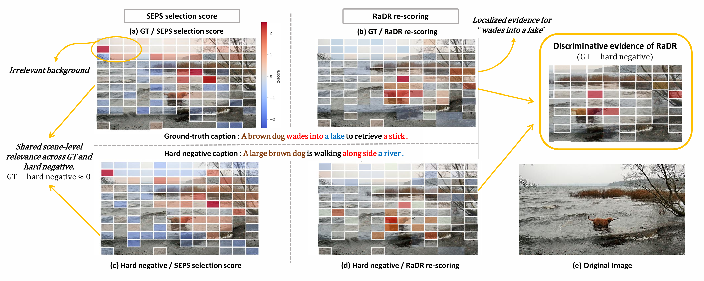
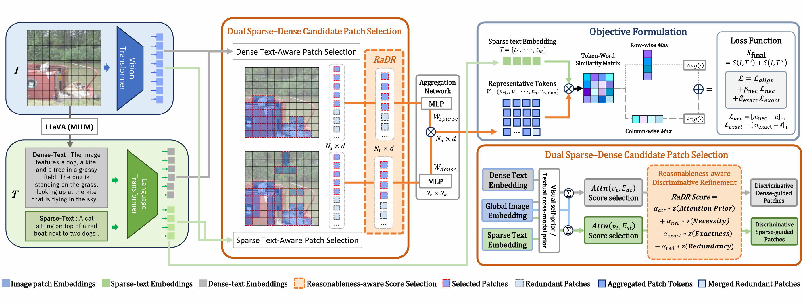

# BeyondPaSli: Discriminative Reweighting for Fine-Grained Cross-Modal Alignment

This repository provides the implementation of **Beyond Patch Slimming: Discriminative Reweighting for Fine-Grained Cross-Modal Alignment**.

BeyondPaSli is a post-selection evidence refinement framework for fine-grained image--text retrieval. We build on the sparse--dense patch selection pipeline of SEPS, but insert **Reasonableness-aware Discriminative Refinement (RaDR)** between patch selection and aggregation. Instead of treating attention-derived patch scores as final evidence, RaDR re-scores the selected patch set using **attention prior**, **necessity**, **exactness**, and **redundancy**, producing a more discriminative evidence set for final token--word matching.

This repository is adapted from [SEPS](https://github.com/Sweet4tars/seps), which refers to the implementations of [LAPS](https://github.com/CrossmodalGroup/LAPS) and [D2S-VSE](https://github.com/liuyyy111/d2s-vse).

Our paper is coming soon.

---

## Introduction

Fine-grained image--text retrieval requires more than detecting coarse semantic overlap between an image and a caption. In large-candidate retrieval, the decisive challenge is to identify which local visual evidence justifies the top-ranked match against semantically confusable hard negatives. A visual patch may be broadly relevant to a caption, but still be replaceable, redundant, or equally compatible with a hard negative.

<div align=center>

</div>

Recent fine-grained cross-modal alignment methods improve local correspondence by matching region--word or patch--word representations. Patch-slimming methods further reduce redundant visual tokens before matching, allowing the model to focus on a compact candidate set. However, existing patch-slimming frameworks mainly ask **which patches should be retained**, while leaving a subsequent question underexplored: **which retained patches should actually govern the final ranking decision?**

This distinction is important because attention-derived relevance is not equivalent to decision-critical evidence. Attention provides a useful prior for identifying potentially relevant visual regions, but a highly attended patch may only capture shared scene-level cues. In hard-negative retrieval, the ground-truth caption and the most confusable distractor often share objects, backgrounds, or coarse visual semantics. As a result, attention-based selection may preserve patches that are plausible for both captions, while failing to emphasize the evidence that separates the correct pair from its hardest negative.

To address this limitation, we propose **BeyondPaSli**, a ranking-sensitive evidence refinement framework for fine-grained cross-modal alignment. BeyondPaSli preserves the sparse--dense patch selection and aggregation backbone of SEPS, but inserts **Reasonableness-aware Discriminative Refinement (RaDR)** between selection and aggregation. RaDR treats attention as an initial prior rather than final evidence, and re-scores the selected patch set using three complementary criteria:

- **Necessity** measures whether a patch is difficult to replace for explaining the positive caption.
- **Exactness** measures whether a patch supports the positive caption more strongly than the hardest negative caption.
- **Redundancy** penalizes substitutable patches that provide overlapping evidence.

By combining these signals with the attention prior, BeyondPaSli reframes patch slimming from **relevance-preserving compression** into **ranking-sensitive evidence refinement**. The final matching stage is therefore driven by patches that are not only relevant, but also necessary, discriminative, and less redundant.

Functionally, BeyondPaSli first obtains candidate patches through sparse--dense text-aware patch selection. RaDR then re-evaluates the selected patches before aggregation, retaining a refined evidence set for bidirectional token--word matching. This design does not generate additional candidates or replace the matching operator. Instead, it changes the evidence structure that enters the final similarity computation.

Extensive experiments on Flickr30K and MS-COCO demonstrate that BeyondPaSli consistently improves image--text retrieval across ViT and Swin backbones at both 224 and 384 resolutions. The largest gains appear in hard-negative retrieval settings. On MS-COCO 5K with Swin-Base-224, BeyondPaSli improves over SEPS by **+42.0 rSum**, including **+11.1 image-to-text R@1** and **+14.3 text-to-image R@1**.

<div align=center>

</div>

---

## Preparation

### Environments

We recommend the following dependencies:

- python >= 3.8
- torch >= 1.12.0
- torchvision >= 0.13.0
- transformers >= 4.32.0
- opencv-python
- tensorboard

---

### Datasets

We have prepared the caption files for two datasets in the `data/` folder, hence you only need to download the images.

The Flickr30K images can be downloaded from [flickr30k-images](https://www.kaggle.com/datasets/hsankesara/flickr-image-dataset). The MSCOCO images can be downloaded from [train2014](http://images.cocodataset.org/zips/train2014.zip) and [val2014](http://images.cocodataset.org/zips/val2014.zip).

The final data structure should be organized as follows:

```text
data
├── coco  # coco captions
│   ├── coco_testall.jsonl
│   ├── coco_train.jsonl
│   ├── train_ids.txt
│   ├── train_caps.txt
│   ├── testall_ids.txt
│   ├── testall_caps.txt
│   └── id_mapping.json
│
├── f30k  # f30k captions
│   ├── f30k_test.jsonl
│   ├── f30k_train.jsonl
│   ├── train_ids.txt
│   ├── train_caps.txt
│   ├── test_ids.txt
│   ├── test_caps.txt
│   └── id_mapping.json
│
├── flickr30k-images # f30k images
│
├── coco-images # coco images
│   ├── train2014
│   └── val2014
```

---

### Model Weights

Our framework uses pretrained weights for [BERT-base](https://huggingface.co/bert-base-uncased), [ViT-base](https://huggingface.co/google/vit-base-patch16-224-in21k), and [Swin-base](https://huggingface.co/microsoft/swin-base-patch4-window7-224).

You can also let [transformers](https://github.com/huggingface/transformers) download the weights automatically. The downloaded weights will be cached under `~/.cache`.

---

## Training

First, set up the training arguments. Detailed information about the arguments is provided in `arguments.py`.

Basic arguments:

- `--dataset`: the dataset name, e.g., `f30k` or `coco`.
- `--data_path`: the root path of datasets, e.g., `data/`.
- `--multi_gpu`: whether to use multiple GPUs with DDP.
- `--gpu-id`: the chosen GPU number, e.g., `0`.
- `--logger_name`: the path for logs and checkpoints, e.g., `runs/f30k_beyondpasli` or `runs/coco_beyondpasli`.

BeyondPaSli/RaDR arguments:

- `--use_reasonable_refine`: whether to enable RaDR.
- `--refine_eval`: whether to use refined evidence during evaluation.
- `--refine_ratio`: the ratio of selected patches retained after RaDR.
- `--reasonable_start_epoch`: the epoch to activate RaDR.
- `--reasonable_warmup_epochs`: the warm-up duration for RaDR.
- `--cf_loss_weight`: the weight for necessity regularization.
- `--exact_loss_weight`: the weight for exactness regularization.
- `--necessity_margin`: the margin for necessity regularization.
- `--exact_margin`: the margin for exactness regularization.
- `--score_attn_weight`: the weight of attention prior in the RaDR score.
- `--score_nec_weight`: the weight of necessity in the RaDR score.
- `--score_exact_weight`: the weight of exactness in the RaDR score.
- `--score_red_weight`: the weight of redundancy in the RaDR score.

Default BeyondPaSli settings:

```text
batch_size = 32
embed_size = 512
aggr_ratio = 0.4
refine_ratio = 0.8
reasonable_start_epoch = 4
reasonable_warmup_epochs = 3
cf_loss_weight = 0.03
exact_loss_weight = 0.03
necessity_margin = 0.01
exact_margin = 0.00
score_attn_weight = 0.10
score_nec_weight = 0.55
score_exact_weight = 0.25
score_red_weight = 0.10
```

For ViT backbones, we use:

```text
sparse_ratio = 0.5
```

For Swin backbones, we use:

```text
sparse_ratio = 0.8
```

Then, run `train.py` for model training. You may need to modify the batch size according to your GPU memory. Multi-GPU training is also supported.

---

```bash
## single GPU

### vit + f30k
python train.py \
  --dataset f30k \
  --gpu-id 0 \
  --logger_name runs/f30k_vit_beyondpasli \
  --batch_size 32 \
  --vit_type vit \
  --embed_size 512 \
  --sparse_ratio 0.5 \
  --aggr_ratio 0.4 \
  --use_reasonable_refine 1 \
  --reasonable_start_epoch 4 \
  --reasonable_warmup_epochs 3 \
  --refine_eval 1 \
  --refine_ratio 0.8 \
  --cf_loss_weight 0.03 \
  --exact_loss_weight 0.03 \
  --necessity_margin 0.01 \
  --exact_margin 0.00 \
  --score_attn_weight 0.10 \
  --score_nec_weight 0.55 \
  --score_exact_weight 0.25 \
  --score_red_weight 0.10

### swin + f30k
python train.py \
  --dataset f30k \
  --gpu-id 0 \
  --logger_name runs/f30k_swin_beyondpasli \
  --batch_size 32 \
  --vit_type swin \
  --embed_size 512 \
  --sparse_ratio 0.8 \
  --aggr_ratio 0.4 \
  --use_reasonable_refine 1 \
  --reasonable_start_epoch 4 \
  --reasonable_warmup_epochs 3 \
  --refine_eval 1 \
  --refine_ratio 0.8 \
  --cf_loss_weight 0.03 \
  --exact_loss_weight 0.03 \
  --necessity_margin 0.01 \
  --exact_margin 0.00 \
  --score_attn_weight 0.10 \
  --score_nec_weight 0.55 \
  --score_exact_weight 0.25 \
  --score_red_weight 0.10

### vit + coco
python train.py \
  --dataset coco \
  --gpu-id 0 \
  --logger_name runs/coco_vit_beyondpasli \
  --batch_size 32 \
  --vit_type vit \
  --embed_size 512 \
  --sparse_ratio 0.5 \
  --aggr_ratio 0.4 \
  --use_reasonable_refine 1 \
  --reasonable_start_epoch 4 \
  --reasonable_warmup_epochs 3 \
  --refine_eval 1 \
  --refine_ratio 0.8 \
  --cf_loss_weight 0.03 \
  --exact_loss_weight 0.03 \
  --necessity_margin 0.01 \
  --exact_margin 0.00 \
  --score_attn_weight 0.10 \
  --score_nec_weight 0.55 \
  --score_exact_weight 0.25 \
  --score_red_weight 0.10

### swin + coco
python train.py \
  --dataset coco \
  --gpu-id 0 \
  --logger_name runs/coco_swin_beyondpasli \
  --batch_size 32 \
  --vit_type swin \
  --embed_size 512 \
  --sparse_ratio 0.8 \
  --aggr_ratio 0.4 \
  --use_reasonable_refine 1 \
  --reasonable_start_epoch 4 \
  --reasonable_warmup_epochs 3 \
  --refine_eval 1 \
  --refine_ratio 0.8 \
  --cf_loss_weight 0.03 \
  --exact_loss_weight 0.03 \
  --necessity_margin 0.01 \
  --exact_margin 0.00 \
  --score_attn_weight 0.10 \
  --score_nec_weight 0.55 \
  --score_exact_weight 0.25 \
  --score_red_weight 0.10


## multiple GPUs

### vit + f30k
CUDA_VISIBLE_DEVICES=0,1 torchrun \
  --master_port=29501 \
  --nproc_per_node=2 \
  train.py \
  --dataset f30k \
  --multi_gpu 1 \
  --logger_name runs/f30k_vit_beyondpasli \
  --batch_size 32 \
  --vit_type vit \
  --embed_size 512 \
  --sparse_ratio 0.5 \
  --aggr_ratio 0.4 \
  --use_reasonable_refine 1 \
  --reasonable_start_epoch 4 \
  --reasonable_warmup_epochs 3 \
  --refine_eval 1 \
  --refine_ratio 0.8 \
  --cf_loss_weight 0.03 \
  --exact_loss_weight 0.03 \
  --necessity_margin 0.01 \
  --exact_margin 0.00 \
  --score_attn_weight 0.10 \
  --score_nec_weight 0.55 \
  --score_exact_weight 0.25 \
  --score_red_weight 0.10

### swin + f30k
CUDA_VISIBLE_DEVICES=0,1 torchrun \
  --master_port=29502 \
  --nproc_per_node=2 \
  train.py \
  --dataset f30k \
  --multi_gpu 1 \
  --logger_name runs/f30k_swin_beyondpasli \
  --batch_size 32 \
  --vit_type swin \
  --embed_size 512 \
  --sparse_ratio 0.8 \
  --aggr_ratio 0.4 \
  --use_reasonable_refine 1 \
  --reasonable_start_epoch 4 \
  --reasonable_warmup_epochs 3 \
  --refine_eval 1 \
  --refine_ratio 0.8 \
  --cf_loss_weight 0.03 \
  --exact_loss_weight 0.03 \
  --necessity_margin 0.01 \
  --exact_margin 0.00 \
  --score_attn_weight 0.10 \
  --score_nec_weight 0.55 \
  --score_exact_weight 0.25 \
  --score_red_weight 0.10

```

---

## Evaluation

Run `eval.py` to evaluate the trained models on Flickr30K or MS-COCO. Specify the model path according to your checkpoint directory.

```bash
python eval.py --dataset f30k --data_path data/ --gpu-id 0
python eval.py --dataset coco --data_path data/ --gpu-id 1
```

---

## Performances

The following table reports the retrieval performance of BeyondPaSli on Flickr30K and MS-COCO. We report Recall@1 and Recall@5 for image-to-text retrieval and text-to-image retrieval, together with rSum.

| Datasets | Visual encoders | I2T R@1 | I2T R@5 | T2I R@1 | T2I R@5 | rSum | Model checkpoint and train log |
|:---:|:---:|:---:|:---:|:---:|:---:|:---:|:---:|
| Flickr30K | ViT-224 | 87.2 | 94.7 | 86.4 | 98.6 | 563.8 | Link |
| Flickr30K | ViT-384 | 92.0 | 96.9 | 91.4 | 99.3 | 578.4 | Link |
| Flickr30K | Swin-224 | 92.0 | 97.3 | 92.4 | 99.6 | 581.1 | Link |
| Flickr30K | Swin-384 | 94.5 | 97.8 | 93.8 | 99.7 | 584.9 | Link |
| MSCOCO-1K | ViT-224 | 90.1 | 95.8 | 89.2 | 99.4 | 572.7 | Link |
| MSCOCO-1K | ViT-384 | 92.4 | 97.2 | 91.7 | 99.8 | 580.1 | Link |
| MSCOCO-1K | Swin-224 | 93.0 | 97.3 | 92.3 | 99.7 | 581.8 | Link |
| MSCOCO-1K | Swin-384 | 94.2 | 98.1 | 93.6 | 99.8 | 585.1 | Link |
| MSCOCO-5K | ViT-224 | 76.3 | 87.8 | 74.9 | 95.3 | 525.9 | Link |
| MSCOCO-5K | ViT-384 | 80.6 | 91.1 | 80.1 | 96.9 | 543.6 | Link |
| MSCOCO-5K | Swin-224 | 83.0 | 91.9 | 81.1 | 97.2 | 548.1 | Link |
| MSCOCO-5K | Swin-384 | 84.4 | 93.5 | 83.8 | 97.8 | 555.6 | Link |

---

## Citation

If you find this repository useful, please cite our paper:

```bibtex
@misc{sim2026beyondpasli,
  title  = {Beyond Patch Slimming: Discriminative Reweighting for Fine-Grained Cross-Modal Alignment},
  author = {Sim, Yerin},
  year   = {2026}
}
```

---

## Acknowledgements

This repository is adapted from [SEPS](https://github.com/Sweet4tars/seps). We also acknowledge the implementations of [LAPS](https://github.com/CrossmodalGroup/LAPS) and [D2S-VSE](https://github.com/liuyyy111/d2s-vse).
